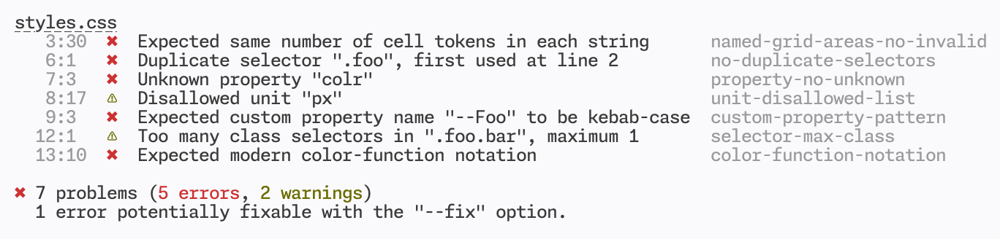

# Stylelint

A mighty CSS linter that helps you avoid errors and enforce conventions.

## Features

It's mighty as it:

- has over **100 built-in rules** for modern CSS syntax and features
- supports **plugins** so you can create your own custom rules
- automatically **fixes problems** where possible
- supports **shareable configs** that you can create or extend
- can **be customized** to your exact needs
- has **15k unit tests** making it robust
- is **trusted by companies worldwide** like Google and GitHub

And it can be extended to:

- extract **embedded styles** from HTML, Markdown and CSS-in-JS template literals
- parse **CSS-like languages** like SCSS, Sass, Less and SugarSS

## How it'll help you

It'll help you **avoid errors**, for example:

- invalid things, e.g. malformed grid areas
- valid things that are problematic, e.g. duplicate selectors
- unknown things, e.g. misspelled property names

And **enforce conventions**, for example:

- disallow things, e.g. specific units
- enforce naming patterns, e.g. for custom properties
- set limits, e.g. the number of ID selectors
- specify notations, e.g. for modern color functions

We recommend using a pretty printer like Prettier alongside Stylelint. Linters and pretty printers are complementary tools that work together to help you write consistent and error-free code.

## Example output

## Guides

- User guide
  - [Getting started](docs/user-guide/get-started.md)
  - [Customizing](docs/user-guide/customize.md)
  - [Configuring](docs/user-guide/configure.md)
  - [Rules](docs/user-guide/rules.md)
  - [Ignoring code](docs/user-guide/ignore-code.md)
  - [CLI](docs/user-guide/cli.md)
  - [Node.js API](docs/user-guide/node-api.md)
  - [PostCSS plugin](docs/user-guide/postcss-plugin.md)
  - [Options](docs/user-guide/options.md)
  - [Errors & warnings](docs/user-guide/errors.md)
- Developer guide
  - [Writing rules](docs/developer-guide/rules.md)
  - [Writing plugins](docs/developer-guide/plugins.md)
  - [Writing custom syntaxes](docs/developer-guide/syntaxes.md)
  - [Writing custom formatters](docs/developer-guide/formatters.md)
  - [Writing system tests](docs/developer-guide/system-tests.md)
- Migration guide
  - [Migrating to 16.0.0](docs/migration-guide/to-16.md)
  - [Migrating to 15.0.0](docs/migration-guide/to-15.md)
  - [Migrating to 14.0.0](docs/migration-guide/to-14.md)
- Maintainer guide
  - [Managing issues](docs/maintainer-guide/issues.md)
  - [Managing pull requests](docs/maintainer-guide/pull-requests.md)
  - [Performing releases](docs/maintainer-guide/releases.md)
- About
  - [Vision](docs/about/vision.md)
  - [Semantic versioning](docs/about/semantic-versioning.md)

## Contributors

Stylelint is maintained by volunteers. Without the code contributions from [all these fantastic people](https://github.com/stylelint/stylelint/graphs/contributors), Stylelint would not exist. [Become a contributor](CONTRIBUTING.md).

### Alumni

We'd like to thank all past members for their invaluable contributions, including two of Stylelint's co-creators [@davidtheclark](https://github.com/davidtheclark) and [@MoOx](https://github.com/MoOx).

### Sponsors

<object data="https://opencollective.com/stylelint/sponsors.svg?width=420&button=false" type="image/svg+xml">
  
</object>

Thank you to all our sponsors! [Become a sponsor](https://opencollective.com/stylelint).

### Backers

<object data="https://opencollective.com/stylelint/backers.svg?width=420&avatarHeight=48&button=false" type="image/svg+xml">
  
</object>

Thank you to all our backers! [Become a backer](https://opencollective.com/stylelint).

### Website hosting

## License

[The MIT License](https://raw.githubusercontent.com/stylelint/stylelint/main/LICENSE).
